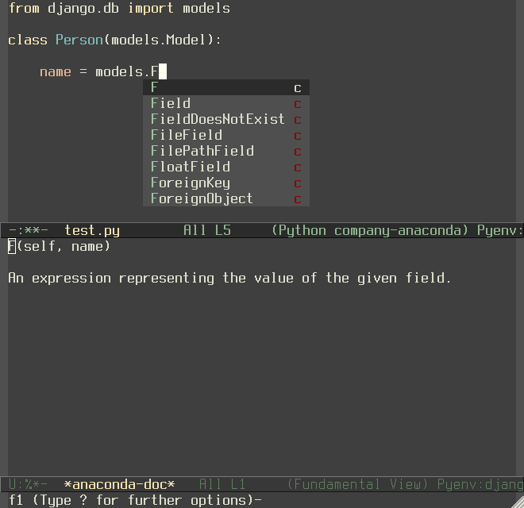

.. |melpa| image:: http://melpa.org/packages/company-anaconda-badge.svg
    :target: http://melpa.org/#/company-anaconda
    :alt: Melpa

================
Company anaconda
================

|melpa|

Anaconda_ backend for company-mode_.

Installation
------------

You can install this package from Melpa_::

    M-x package-install RET company-anaconda RET

Usage
-----

Add ``company-anaconda`` to allowed ``company-mode`` backends list

.. code:: lisp

    (eval-after-load "company"
     '(add-to-list 'company-backends 'company-anaconda))

Enable ``anaconda-mode`` in buffers you want to use ``company-anaconda``

.. code:: lisp

    (add-hook 'python-mode-hook 'anaconda-mode)

If you want to see ``anaconda-mode`` completions together with ones
comes from inferior python process use company grouped backend instead:

.. code:: lisp

    (eval-after-load "company"
     '(add-to-list 'company-backends '(company-anaconda :with company-capf)))

Customization
-------------

By default, company-anaconda uses Jedi's ``description`` for
candidates as annotations in company-mode's list of completions.  This
usually tells you the type, and often the fully-qualified name, of a
completion candidate.  For example, for a candidate ``a_method``, you
may see the annotation ``<function: some_module.SomeClass.a_method>``.

You can customize these annotations by setting
``company-anaconda-annotation-function`` to a function that takes a
candidate string and returns the string company-mode should use as the
annotation for that candidate.  The candidate string *may* have the
following text properties, which provide additional information about the candidate:

- description: Jedi's description, typically the type of completion
  optionally followed by a fully-qualified name for the candidate.  For example, \"class: foo.bar.Baz\" or \"statement\".

- module-path: The path to the file that contains this candidate.

- line: The line within that file where the candidate is defined.

- docstring: The candidate's docstring.

Here is an example of an alternate annotation function that only returns the first letter of the candidate's ``description`` property (indicating its type) in chevrons:

.. code:: lisp

    (defun my-annotation-function (candidate)
      (let ((description (get-text-property 0 'description candidate)))
        (when description
          (concat "<" (substring description 0 1) ">"))))

    (setq company-anaconda-annotation-function 'my-annotation-function)

For a candidate with a description such as ``function:
some_module.SomeClass.a_method``, this would make its annotation in
company-mode's completion list simply ``<f>``.

.. _Anaconda: https://github.com/proofit404/anaconda-mode
.. _company-mode: http://company-mode.github.io/
.. _Melpa: http://melpa.milkbox.net/
